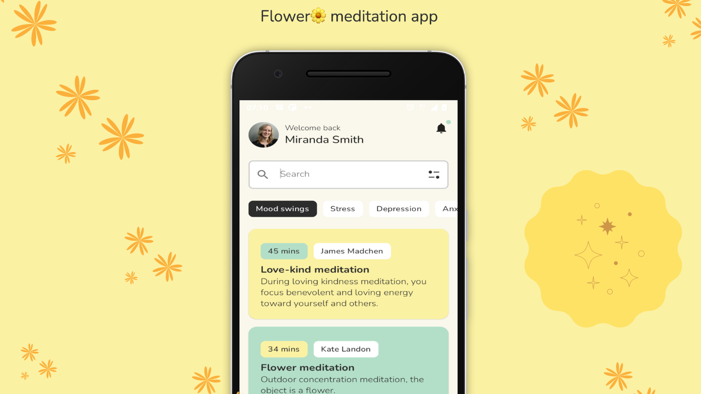

# Meditation App

Meditation App is a native Android Jetpack Compose UI sample for a calm meditation home screen. It includes a profile header, search field, mood filter chips, and a scrolling list of meditation sessions.

The UI concept and inspiration came from [Taras Migulko's Flower Meditation App design](https://dribbble.com/shots/18251176-Flower-Meditation-app).



## Features

- Jetpack Compose home screen
- Profile header with avatar, welcome text, and notification icon
- Search bar with leading search icon and trailing filter icon
- Horizontal mood/category filter chips
- Vertical meditation session list
- Session cards with duration, teacher, title, description, and custom colors
- Local sample meditation data
- Custom Nunito font assets
- Soft color palette with green, yellow, black, and warm gray tones
- Static UI sample with no backend dependency

## Tech Stack

- Kotlin
- Android Jetpack Compose
- Compose Material
- AndroidX Activity Compose
- Gradle / Android Gradle Plugin
- JUnit and AndroidX test dependencies

## Project Structure

```text
.
+-- README.md
+-- images/
|   +-- meditationapp.png
+-- build.gradle
+-- settings.gradle
+-- gradle.properties
+-- app/
|   +-- build.gradle
|   +-- src/main/
|       +-- AndroidManifest.xml
|       +-- java/com/alirahimi/meditationapp/
|       |   +-- MainActivity.kt
|       |   +-- HeaderProfile.kt
|       |   +-- SearchBar.kt
|       |   +-- FilterOptions.kt
|       |   +-- MeditationLists.kt
|       |   +-- utilities/
|       |   |   +-- Constants.kt
|       |   |   +-- FilterContent.kt
|       |   |   +-- MeditationType.kt
|       |   +-- ui/theme/
|       |       +-- Color.kt
|       |       +-- Shape.kt
|       |       +-- Theme.kt
|       |       +-- Type.kt
|       +-- res/
|           +-- drawable/
|           +-- font/
|           +-- values/
```

## Main Components

| Component | Purpose |
| --- | --- |
| `MainActivity` | Starts the Compose UI and arranges the home screen sections. |
| `HeaderProfile` | Displays the user avatar, welcome message, name, and notification icon. |
| `SearchBar` | Shows the search input with search and filter icons. |
| `FilterOptions` | Renders horizontal filter chips from `FILTER_CONTENT_LIST`. |
| `ChipComponent` | Reusable button-style chip for each filter option. |
| `MeditationTypes` | Displays the vertical list of meditation sessions. |
| `MeditationOption` | Renders one meditation card with duration, teacher, title, and description. |
| `FilterContent` | Data model for filter chip text and colors. |
| `MeditationType` | Data model for session details and card colors. |

## Screen Content

The current static profile header shows:

| Field | Value |
| --- | --- |
| Greeting | `Welcome back` |
| User | `Miranda Larsen` |

Filter chips are defined in `Constants.kt`:

- Mood swings
- Stress
- Depression
- Anxiety
- Anger
- Excitement
- Fear
- Joy
- Horror

Meditation cards are also defined in `Constants.kt`:

| Duration | Teacher | Title |
| --- | --- | --- |
| `45 mins` | `James Madchen` | `Love-kind meditation` |
| `34 mins` | `Kate Landon` | `Flower meditation` |
| `25 mins` | `David Wilson` | `Breather` |

The list repeats these sample entries to fill the home feed.

## UI Assets

The project includes:

- `images/meditationapp.png` for the README preview
- `profilepicture.jpg` for the circular profile image
- `filter.png` for the search bar filter icon
- Nunito font files: regular, light, medium, and bold
- Default launcher assets generated by Android Studio

## Theme

Custom colors are defined in `Color.kt`:

| Name | Hex |
| --- | --- |
| `Green` | `#B3DEC7` |
| `Yellow` | `#FBF1A3` |
| `Black` | `#2C2C2C` |
| `Grey` | `#FAF7ED` |

These colors are used directly in cards, chips, and the screen background.

## Requirements

- Android Studio
- JDK 8 or newer
- Android SDK with compile SDK 32
- Android device or emulator running Android 5.0+ because `minSdk` is 21

Project configuration:

| Setting | Value |
| --- | --- |
| Application ID | `com.alirahimi.meditationapp` |
| Min SDK | 21 |
| Target SDK | 32 |
| Compile SDK | 32 |
| Version | 1.0 |
| Android Gradle Plugin | 7.1.3 |
| Kotlin Plugin | 1.5.21 |
| Compose Version | 1.0.1 |

## How to Run

Open the project in Android Studio, let Gradle sync, then run the `app` configuration on an emulator or Android device.

From the terminal:

```bash
./gradlew assembleDebug
```

Install on a connected device:

```bash
./gradlew installDebug
```

## Notes

- This repository is a UI sample, not a full meditation platform.
- Search, filter, notification, and card buttons currently have placeholder behavior.
- The text field currently uses an empty static value, so it does not keep typed search text yet.
- Meditation sessions and filters are hard-coded in `Constants.kt`.
- The app uses local assets and does not require network access.

## Possible Improvements

- Add state handling for the search field
- Make filter chips selectable
- Move screen data into a ViewModel
- Add navigation to meditation detail screens
- Add audio playback or session timer behavior
- Add Compose previews for individual components
- Add dark mode-specific colors
- Update Compose, Kotlin, and Android Gradle Plugin versions
